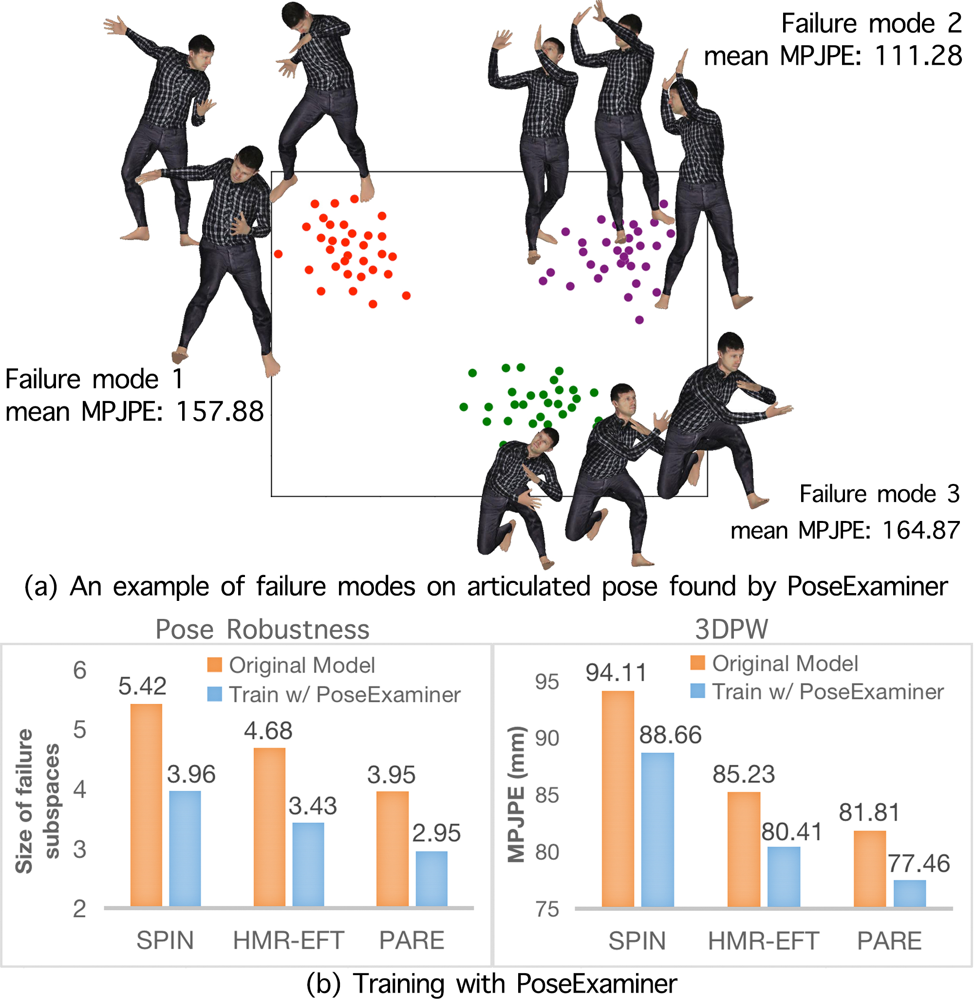

# PoseExaminer (CVPR2023)

__________



#### [PoseExaminer: Automated Testing of Out-of-Distribution Robustness in Human Pose and Shape Estimation](https://arxiv.org/pdf/2303.07337.pdf) 
#### CVPR2023
#### [Qihao Liu](https://qihao067.github.io/) | [Adam Kortylewski](https://gvrl.mpi-inf.mpg.de/) | [Alan Yuille](https://cogsci.jhu.edu/directory/alan-yuille/) 

This repository contains the code and model of [PoseExaminer](https://arxiv.org/pdf/2303.07337.pdf). It is built on [MMHuman3D](https://github.com/open-mmlab/mmhuman3d) to be able to be applied to different methods. By following the introduction, you will be able to run our adversarial examiner on any human pose and shape estimation method (e.g. [PARE](https://pare.is.tue.mpg.de/)). Then, you can improve the model's performance by fine-tuning it on the identified failure modes (e.g., the released code improves PARE from 81.81 to 73.65 MPJPE on the 3DPW dataset). More coming soon.

______

## Requirements

The code has been tested with PyTorch 1.7.1 and Cuda 11.4.

```
conda env create -f adv_env.yaml

mkdir third_party
cd third_party

pip install git+https://github.com/mkocabas/yolov3-pytorch.git
pip install git+https://github.com/mkocabas/multi-person-tracker.git
pip install git+https://github.com/giacaglia/pytube.git

git clone https://github.com/nghorbani/human_body_prior.git
cd human_body_prior
python setup.py develop

pip install "mmcv-full>=1.3.17,<=1.5.3" -f https://download.openmmlab.com/mmcv/dist/cu113/torch1.1.1/index.html
pip install "mmdet<=2.25.1"
pip install "mmpose<=0.28.1"

cd ../..
```

________

## Data & Model Preparation

1. Download official pertained [PARE model](https://openmmlab-share.oss-cn-hangzhou.aliyuncs.com/mmhuman3d/models/pare/without_mosh/hrnet_w32_conv_pare.pth?versionId=CAEQOhiBgMCi4YbVgxgiIDgzYzFhMWNlNDE2NTQwN2ZiOTQ1ZGJmYTM4OTNmYWY5) to 

____________

## Notes

1. Our code release exclusively focuses on the articulated pose. By following the instructions, you should be able to conduct a comprehensive evaluation of the SOTA method (i.e., PARE) and enhance its performance on the 3DPW dataset from the reported 81.81 to 73.65, following approximately 10 hours of training. This improvement slightly surpasses the number reported in the original research paper (74.44 MPJPE).

2. 
   Since the synthetic training data depends on the failure modes identified by the PoseExaminer, and we disable the loss function for policy distance, the results may vary to some degree. When releasing the code, we conducted the experiment ten times, and we achieved an average MPJPE of 75.40 on the 3DPW dataset. If the obtained result falls short of your expectations, you can simply rerun the experiment

3. Our experiment required 8 GPUs with a minimum RAM capacity of 24 GB to employ 40 agents at the same time. However, to run the experiment on a reduced number of GPUs, it is possible to employ a smaller number of agents during each adversarial search process and repeat the process multiple times. As an example, you could run the search process four times, utilizing 10 agents during each process (leading to 40 failure modes in total).  To support such experiments, we have disabled the loss function associated with policy distance. Nevertheless, if you have enough GPUs, you can add this loss function back.

4. Please note that the poses may appear quite unusual. This is because our search for articulated poses is conducted under very simple conditions. We do not consider any other challenges such as occlusion, camera viewpoint, OOD body shapes, and we utilize a white background and easily distinguishable human textures during evaluation. (Different parts of the body, e.g., the torso, the thighs, the calves, and the arms, have different textures). The current SOTA methods demonstrate high accuracy in such easy settings, and as a result, only the unusual poses tend to result in significant errors.

   In addition, our objective is to identify the worst cases that cause the largest errors (e.g. an MPJPE exceeding 300). The only constraint we impose on the poses is their physical plausibility. It is evident that the most unusual poses typically lead to the largest errors. If your want to find poses that cause relatively large errors but still look normal, we suggest you (1) use a more stringent physical constraint by e.g. setting narrower joint ranges for each human joint, (2) stop the search process once the error surpasses a predefined threshold (e.g., 90 or 120), rather than continuing to search for the worst poses that have very large MPJPE.

   We also find these strange/less common poses useful to improve the performance of current methods.

____________

## License

The code in this repository is released under the MIT License. [MMHuman3D](https://github.com/open-mmlab/mmhuman3d) is released under the [Apache 2.0 license](https://github.com/open-mmlab/mmhuman3d/blob/main/LICENSE). Some supported methods may carry [additional licenses](https://github.com/open-mmlab/mmhuman3d/blob/main/docs/additional_licenses.md).

_____________

## BibTeX

```
@inproceedings{liu2023poseexaminer,
  title={PoseExaminer: Automated Testing of Out-of-Distribution Robustness in Human Pose and Shape Estimation},
  author={Liu, Qihao and Kortylewski, Adam and Yuille, Alan L},
  booktitle={Proceedings of the IEEE/CVF Conference on Computer Vision and Pattern Recognition},
  pages={672--681},
  year={2023}
}
```

